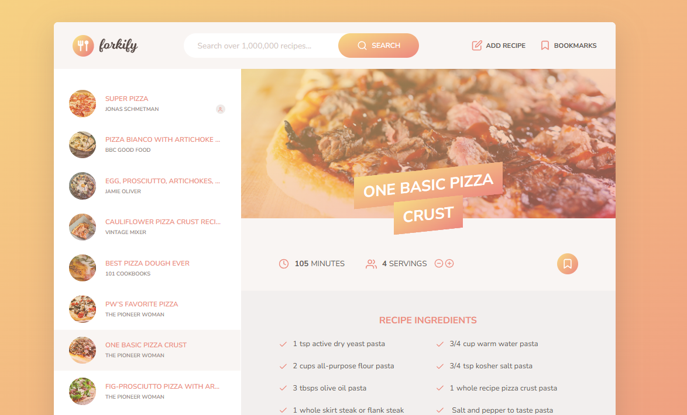
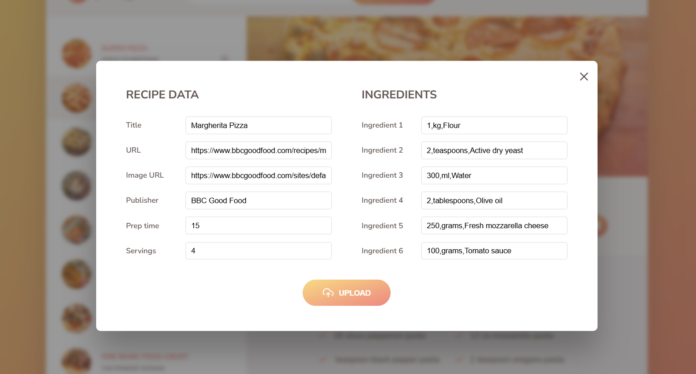

# Forkify - Recipe Finder and Bookmarking Website 🍲

Forkify is a web app where you can search for recipes, add your own recipes, and bookmark your favorites! You can also view saved bookmarks, browse through multiple pages of search results, and adjust the number of servings, which updates the ingredient quantities automatically.

## Features 🚀

- 🔍 **Search for Recipes**: Find recipes based on ingredients.
- 🍴 **Add Your Own Recipes**: Add custom recipes to the app.
- ❤️ **Bookmark Recipes**: Save your favorite recipes for easy access.
- 📖 **View Saved Bookmarks**: Access your saved recipes in one place.
- 🔄 **Pagination**: Browse through multiple pages of search results.
- 🍽️ **Adjust Servings**: Change the number of servings, and the ingredients adjust accordingly.

## Tech Stack 🖥️

- **Frontend**: HTML5, CSS3, JavaScript (ES6+)
- **Backend**: None (Static website)
- **Libraries**: Parcel for bundling
- **Node.js**: Used for development tools and running the app locally

## Demo 🌟

Check out the live demo of Forkify here: [Live Demo on Netlify](https://forkify-project-ryannyberg.netlify.app/)

**Website Screenshots:**

- **Main Page:**  
    
  *Homepage where users can search for recipes.*

- **Adding a Recipe:**  
    
  *Page where users can add their own recipes.*

## How to Run Locally ⚙️

To run **Forkify** locally on your machine, follow these steps:

1. Clone the repository:
   
   `git clone https://github.com/ryan-nyberg/Forkify-Website.git`

3. Install dependencies:
   
   `npm install`

4. Start the local development server:
   
   `npm start`

Now, open your browser and go to http://localhost:1234 to see the Forkify app running locally.

